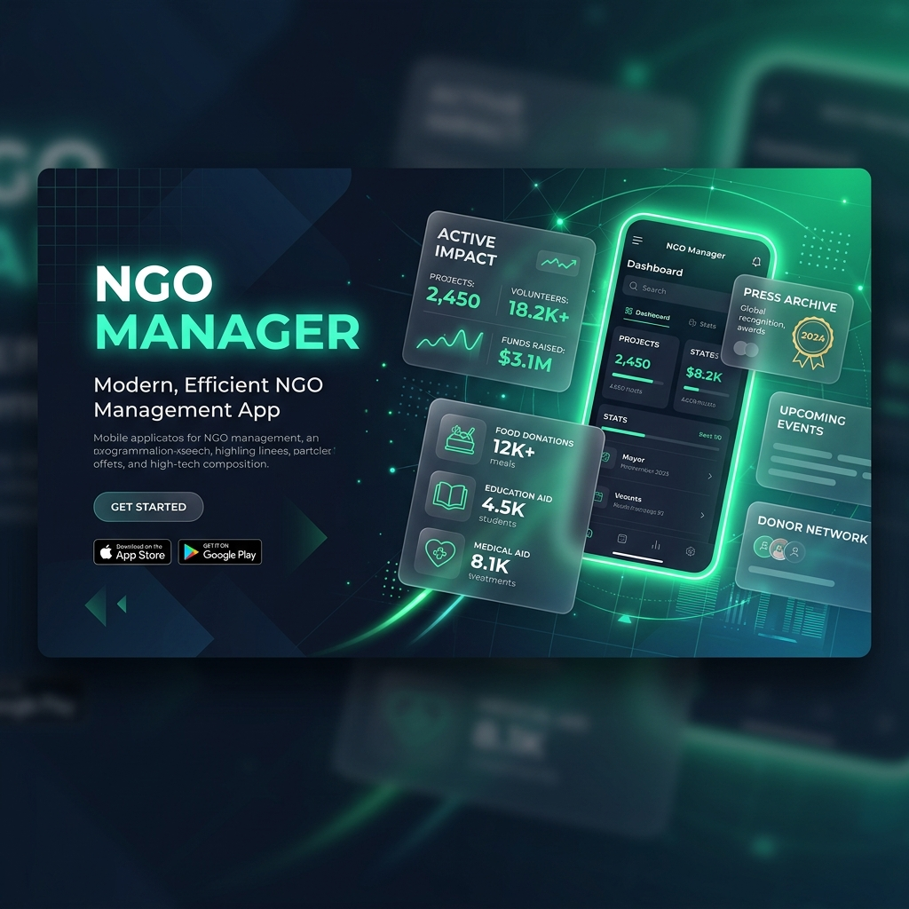
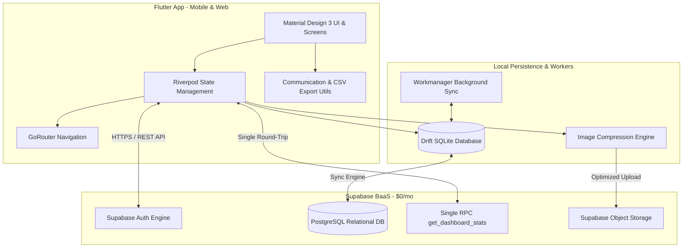
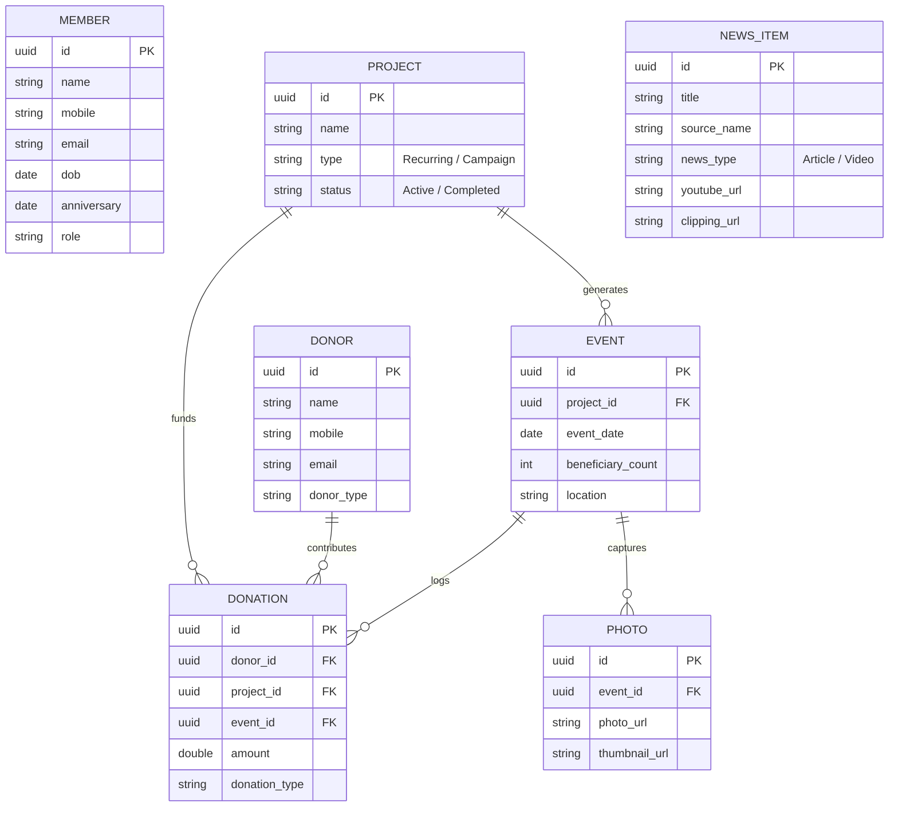

<p align="center">
  
</p>

<h1 align="center">🌿 NGO Manager</h1>

<p align="center">
  <strong>The Ultimate All-in-One Operating System & Media Archive for Non-Profit Organizations</strong>
</p>

<p align="center">
  <a href="https://flutter.dev"></a>
  <a href="https://supabase.com"></a>
  <a href="https://drift.simonbinder.eu"></a>
  <a href="https://riverpod.dev"></a>
  <a href="#"></a>
</p>

<p align="center">
  <a href="#-overview">Overview</a> •
  <a href="#-key-features">Features</a> •
  <a href="#-system-architecture">Architecture</a> •
  <a href="#-tech-stack">Tech Stack</a> •
  <a href="#-getting-started">Getting Started</a> •
  <a href="#-zero-cost-breakdown">Zero-Cost Matrix</a> •
  <a href="#-roadmap">Roadmap</a>
</p>

---

## 🌟 Overview

**NGO Manager** is an enterprise-grade, offline-first mobile and web application built specifically for non-profit organizations to streamline day-to-day operations, track recurring outreach initiatives, centralize donor contributions, and preserve public media coverage.

### 💡 Why NGO Manager Exists

Many non-profits operate with high passion but fragmented tooling — juggling contact details across **spreadsheets**, coordinating events over **WhatsApp groups**, storing event photos on **personal mobile devices**, and losing track of historical press coverage.

NGO Manager consolidates these critical workflows into a **single, unified, intuitive hub**:
- 📱 **Centralized Member & Volunteer Directory** with automated birthday & anniversary outreach and instant CSV exporting.
- 💳 **Donor Intelligence & Automatic Contribution Tracking** built directly into event logging workflows with automated WhatsApp receipts.
- 🔁 **Recurring Drive & Campaign Management** (e.g., Weekly Wednesday Food Drives, Education Aid).
- 📸 **Offline Photo & Documentation Vault** auto-tagged by event and compressed for cloud storage.
- 📰 **Public Media & Press Archive** embedding YouTube coverage and physical newspaper clippings.
- ⚡ **Optimized Single RPC Performance** fetching complete dashboard analytics in 1 network round-trip.
- 💰 **100% Free Infrastructure** designed to run seamlessly on standard cloud free tiers without any ongoing hosting overhead.

---

## ✨ Key Features

| Feature Module | Description & Capabilities |
| :--- | :--- |
| **📊 Smart Dashboard** | At-a-glance real-time analytics powered by a single Postgres RPC (`get_dashboard_stats`): total members, active donors, monthly donation totals, upcoming events calendar, and quick-action 7-day birthday/anniversary widgets. |
| **👥 Member Directory & Celebrations** | Searchable member catalog with contact info, roles, join dates, **CSV Exporting (`ExportUtils`)**, and **one-tap personalized WhatsApp outreach** for birthdays & anniversaries (`CommunicationUtils`). |
| **💰 Donor Intelligence** | Auto-registers new donors during field event logging. Tracks lifetime contribution history, donation types (*Cash, Kind, Service*), linked campaign drives, CSV exports, duplicate checks, and sends instant **WhatsApp donation receipts**. |
| **📋 Project & Event Tracking** | Supports both **Recurring Drives** (auto-generating weekly event instances) and **Ongoing Campaigns** (e.g., Medical Aid). Tracks volunteer attendance, beneficiary count, expenses, and notes. |
| **📸 Event Photo Vault** | In-field camera photo capture auto-linked to specific project drives. Client-side image compression algorithm reduces payload size before background cloud sync. |
| **📰 Press & Media Archive** | Interactive showcase of external press coverage. Supports embedded **YouTube Video Players** and high-resolution **Newspaper Clippings** with read-only public access. |
| **⚡ Offline-First Architecture** | Full offline support using **Drift (SQLite)**. Volunteers log ground activity in low-connectivity zones; background workers sync queued changes once connectivity returns. |
| **🛡 Friendly Error Handling** | Standardized error normalization (`ErrorUtils`) mapping raw exceptions to friendly user-facing feedback without leaking internal details. |

---

## 🏗 System Architecture

NGO Manager utilizes a clean, decoupled architecture separating client-side offline storage, state management, service handlers, and cloud backend interfaces:



---

## 📐 Data Model & Entity Relations



---

## 🛠 Tech Stack

### Frontend & Core
- **Framework:** [Flutter 3.x](https://flutter.dev) (Dart 3.x) — Cross-platform support (Android, Web, iOS).
- **State Management:** [Flutter Riverpod 2.x](https://riverpod.dev) — Code-generated reactive dependency injection & state binding.
- **Routing:** [GoRouter](https://pub.dev/packages/go_router) — Declarative route management with deep linking capabilities.
- **Design System:** Material Design 3, Google Fonts (Inter/Outfit), Shimmer loading, Staggered Animations.
- **Export & Sharing:** [share_plus](https://pub.dev/packages/share_plus) + [path_provider](https://pub.dev/packages/path_provider) for CSV file exports.
- **Outreach & Communication:** [url_launcher](https://pub.dev/packages/url_launcher) for WhatsApp, SMS, and Direct Calls.

### Offline & Backend Services
- **Cloud Backend:** [Supabase](https://supabase.com) — Managed PostgreSQL database, Row Level Security, Auth & Object Storage.
- **RPC Query Optimization:** Single-trip Postgres RPC function (`get_dashboard_stats`).
- **Offline Engine:** [Drift](https://drift.simonbinder.eu) (SQLite) — Reactive local database with offline sync queues.
- **Background Tasks:** [Workmanager](https://pub.dev/packages/workmanager) — Native background process orchestration.
- **Media Optimization:** `image_picker` + `flutter_image_compress` + `cached_network_image`.

---

## 📁 Repository Structure

```ascii
ngo/
├── ngo_app/                       # Main Flutter Application
│   ├── lib/
│   │   ├── main.dart              # Application Entrypoint
│   │   ├── config/                # Global Theme, Routes & Supabase Config
│   │   │   ├── constants.dart
│   │   │   ├── router.dart
│   │   │   ├── supabase_config.dart
│   │   │   └── theme.dart
│   │   ├── models/                # Freezed & JSON Serializable Data Models
│   │   ├── screens/               # Feature Views & UI Layouts
│   │   │   ├── auth/              # Admin Authentication
│   │   │   ├── dashboard/         # Analytics & Quick Widgets
│   │   │   ├── members/           # Member Directory & Outreach
│   │   │   ├── donors/            # Donor Ledger & Profiles
│   │   │   ├── projects/          # Drives & Campaign List
│   │   │   ├── events/            # In-field Event Tracker
│   │   │   ├── photos/            # Photo Galleries
│   │   │   └── news/              # Press Coverage Archive
│   │   ├── services/              # API Clients, Offline Sync & Logic Layer
│   │   │   ├── auth_service.dart
│   │   │   ├── background_worker.dart
│   │   │   ├── dashboard_service.dart # Single RPC stats provider
│   │   │   ├── donor_service.dart
│   │   │   ├── event_service.dart
│   │   │   ├── member_service.dart
│   │   │   ├── news_service.dart
│   │   │   ├── notification_service.dart
│   │   │   ├── photo_service.dart
│   │   │   └── project_service.dart
│   │   ├── utils/                 # Utility Handlers
│   │   │   ├── communication_utils.dart # WhatsApp, Call, SMS shortcuts
│   │   │   ├── error_utils.dart         # Friendly exception formatting
│   │   │   └── export_utils.dart        # CSV Member & Donor Exporting
│   │   └── widgets/               # Reusable Glassmorphic & UI Components
│   ├── test/                      # Unit & Service Test Suites
│   └── pubspec.yaml               # Package Dependencies & Assets Manifest
│
├── supabase/                      # Cloud Database Configuration & Migrations
│   ├── migrations/
│   │   ├── 001_initial_schema.sql # Core PostgreSQL Relational Schema
│   │   └── 002_add_video_support.sql # Video Media Support Patch
│   └── storage_policies.sql       # RLS & Storage Bucket Security Policies
│
├── docs/                          # Documentation Assets & Screenshots
│   └── assets/
│       └── banner.png             # Modern Hero Header Graphic
└── README.md                      # ← You are here
```

---

## 🚀 Getting Started

### Prerequisites

Ensure your local development environment meets the following requirements:
- **Flutter SDK:** `≥ 3.8.1` — [Installation Guide](https://docs.flutter.dev/get-started/install)
- **Dart SDK:** `≥ 3.8.1` (bundled with Flutter)
- **Supabase Account:** [Create Free Account](https://supabase.com)
- **Device/Emulator:** Android Studio Emulator, Chrome Browser, or Physical Device.

---

### Step-by-Step Setup Guide

#### 1. Clone the Repository
```bash
git clone https://github.com/your-org/ngo-manager.git
cd ngo
```

#### 2. Configure Supabase Cloud Backend
1. Log into your [Supabase Console](https://app.supabase.com) and create a new project.
2. Navigate to the **SQL Editor** tab and execute the migration files in sequence:
   - `supabase/migrations/001_initial_schema.sql`
   - `supabase/migrations/002_add_video_support.sql`
3. Execute `supabase/storage_policies.sql` to establish security rules for media buckets.
4. Retrieve your **Project URL** and **Anon Key** from `Project Settings -> API`.

#### 3. Set Up Environment Credentials
Open `ngo_app/lib/config/supabase_config.dart` and update with your keys:
```dart
abstract class SupabaseConfig {
  static const String supabaseUrl = 'https://YOUR_PROJECT_ID.supabase.co';
  static const String supabaseAnonKey = 'YOUR_SUPABASE_ANON_KEY';
}
```

#### 4. Install Dependencies & Build Code
```bash
cd ngo_app

# Fetch pub dependencies
flutter pub get

# Generate immutable models & Riverpod code
dart run build_runner build --delete-conflicting-outputs
```

#### 5. Launch the Application
```bash
# Run on Web (Chrome)
flutter run -d chrome

# Run on Android Device / Emulator
flutter run -d android

# Run on iOS Device / Simulator
flutter run -d ios
```

---

## 💰 Zero-Cost Infrastructure Matrix

NGO Manager is meticulously engineered to fit **100% inside free tier allowances**, delivering high operational efficiency with **$0 monthly hosting costs**:

| Resource Component | Provider Free Tier Limit | NGO Manager Projected Usage | Cost |
| :--- | :--- | :--- | :---: |
| **PostgreSQL Database** | 500 MB relational storage | ~150,000 text records & event logs | **$0** |
| **Cloud File Storage** | 1.0 GB media bucket | ~8,000 compressed photos with thumbnails | **$0** |
| **Authentication** | 50,000 Monthly Active Users | Admin & public read-only tier | **$0** |
| **API Requests** | Unlimited API calls | Real-time REST endpoints & RPC calls | **$0** |
| **Total Monthly Overhead**| | | **$0 / mo** |

---

## 🗺 Product Roadmap

- [x] **v1.0 (Current Baseline)**
  - [x] Centralized Member & Donor Directories with auto-duplicate detection.
  - [x] Recurring Project Drives (Weekly Wednesday Food Drives) & Ongoing Campaigns.
  - [x] In-field event logging with offline SQLite fallback.
  - [x] Press Coverage Archive with embedded YouTube player & print clippings.
  - [x] Client-side photo compression & automated thumbnail creation.
  - [x] **CSV Member & Donor Record Exporting (`ExportUtils`)**.
  - [x] **Automated Personalized WhatsApp Outreach (Birthdays, Anniversaries, Donation Receipts)**.
  - [x] **Single RPC Performance Optimization (`get_dashboard_stats`)**.
- [ ] **v2.0 (Upcoming Release)**
  - [ ] Interactive Visual Analytics & Charts view in Dashboard.
  - [ ] Granular Multi-Role Permissions (Admin, Coordinator, Field Volunteer).
  - [ ] Direct Bulk WhatsApp messaging integration.
  - [ ] FCM Push Notifications for upcoming drives & member milestones.
- [ ] **v3.0 (Future Horizon)**
  - [ ] Online Payment Gateway integration (UPI / Razorpay / Stripe).
  - [ ] Public Beneficiary Case Tracking & Sponsorship Transparency Portal.

---

## 📄 License & Compliance

This repository is maintained for internal NGO management. Designed with privacy standards adhering to basic guidelines under India's Digital Personal Data Protection (DPDP) Act.

---

<p align="center">
  <sub>Made with ❤️ for non-profit organizations striving to create a better world.</sub>
</p>
